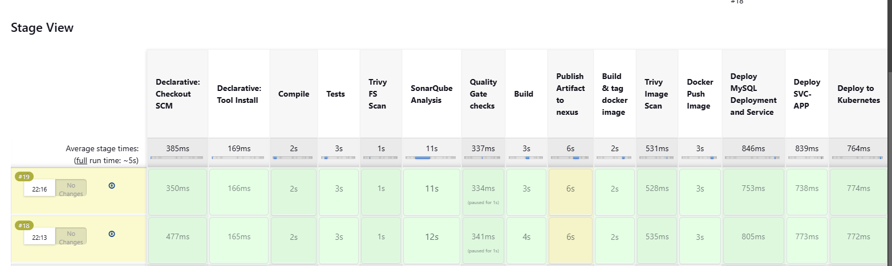
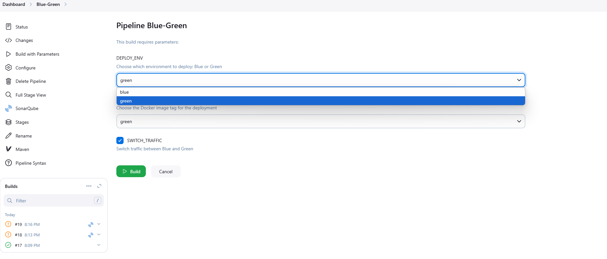

# Full Devops project deployment to eks using blue/green deployment which mean Zero DownTime when update . 


### About
Java maven project deployment to EKS 

### Infrastructre 
- Terraform for managing the resources in aws .
- AWS - VPC, Security Groups.
- AWS - EC2.
- Docker.
- AWS EKS 
- Jenkins server for ci/cd
- DevSecOps:
  - SAST(static): for source code 
     - solarqube - code quality check.
        - Check for code coverage(how many lines from code are tested ,  code quality checks(bugs,vulnerabilities,code smell)
- DAST(dynamic): for filesystem and image 
  -  travis (for the filesystem and container)
- Nexus -  artifact the package.
- Linux + bash scripts .
- JavaSpring Boot + mysql database.

### CI/CD Process (Jenkins Pipeline):



### Results:
```
$ kubectl get all -n webapps
NAME                                READY   STATUS    RESTARTS        AGE
pod/bankapp-blue-6c75c748cd-659fj   1/1     Running   1 (5m55s ago)   6m20s
pod/mysql-77b9d5d45-6pjgt           1/1     Running   0               6m22s

NAME                      TYPE           CLUSTER-IP       EXTERNAL-IP                                                               PORT(S)        AGE
service/bankapp-service   LoadBalancer   10.100.43.194    a6596ff6951f64952bbbca9818947bce-2053185439.eu-west-1.elb.amazonaws.com   80:31635/TCP   6m21s
service/mysql-service     ClusterIP      10.100.192.212   <none>                                                                    3306/TCP       6m22s

NAME                           READY   UP-TO-DATE   AVAILABLE   AGE
deployment.apps/bankapp-blue   1/1     1            1           6m20s
deployment.apps/mysql          1/1     1            1           6m22s

NAME                                      DESIRED   CURRENT   READY   AGE
replicaset.apps/bankapp-blue-6c75c748cd   1         1         1       6m20s
replicaset.apps/mysql-77b9d5d45           1         1         1       6m22s
[ec2-user@ip-11-0-1-28 ~]$ kubectl get all -n webapps
NAME                                 READY   STATUS    RESTARTS       AGE
pod/bankapp-blue-6c75c748cd-659fj    1/1     Running   1 (8m4s ago)   8m29s
pod/bankapp-green-646bc4d8d8-d2q6z   1/1     Running   0              13s
pod/mysql-77b9d5d45-6pjgt            1/1     Running   0              8m31s

NAME                      TYPE           CLUSTER-IP       EXTERNAL-IP                                                               PORT(S)        AGE
service/bankapp-service   LoadBalancer   10.100.43.194    a6596ff6951f64952bbbca9818947bce-2053185439.eu-west-1.elb.amazonaws.com   80:31635/TCP   8m30s
service/mysql-service     ClusterIP      10.100.192.212   <none>                                                                    3306/TCP       8m31s

NAME                            READY   UP-TO-DATE   AVAILABLE   AGE
deployment.apps/bankapp-blue    1/1     1            1           8m29s
deployment.apps/bankapp-green   1/1     1            1           13s
deployment.apps/mysql           1/1     1            1           8m31s

NAME                                       DESIRED   CURRENT   READY   AGE
replicaset.apps/bankapp-blue-6c75c748cd    1         1         1       8m29s
replicaset.apps/bankapp-green-646bc4d8d8   1         1         1       13s
replicaset.apps/mysql-77b9d5d45            1         1         1       8m31s
$

```
